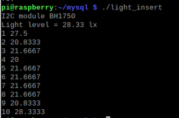
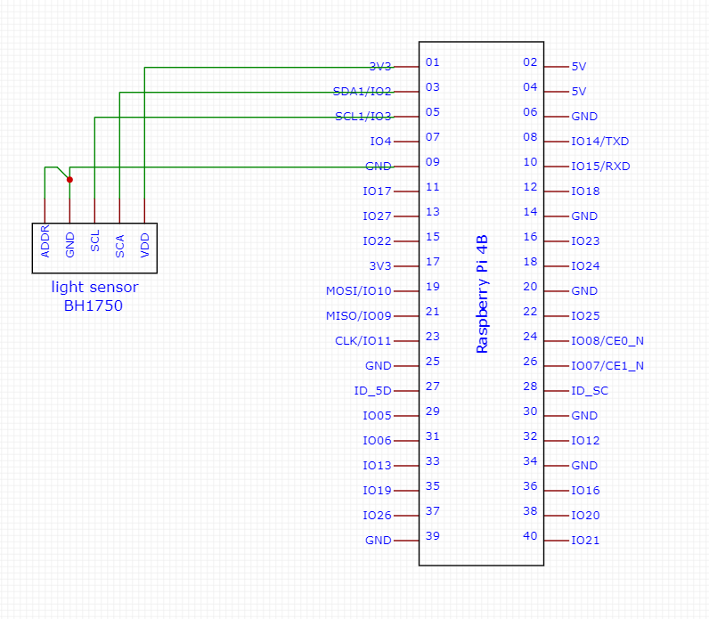

# RaspberryPi & MySQL #

  Projects that demonstrate C code programming skills 

- [RaspberryPi \& MySQL](#raspberrypi--mysql)
  - [Main objectives](#main-objectives)
    - [PHOTO](#photo)
    - [Description](#description)
    - [MYSQL settings](#mysql-settings)
    - [Raspberry Pi](#raspberry-pi)

## Main objectives ##

### PHOTO ###

### Description ###

- Light Sensor BH1750 - I2C interface
- Program inserts next lux value and show all records

### MYSQL settings ###

- logging: 
  
    
<code> mysql -u root -p 
</code>

- creating database: 

    
<code>CREATE DATABASE measurment;</code>

- creating table: 

    
<code>CREATE TABLE light(lp SERIAL, luxlevel REAL);</code>

- creating user: 

    
<code>CREATE USER 'bh1750'@'localhost' IDENTIFIED BY 'lux';</code>

 - user privileges:

    
<code>GRANT INSERT, SELECT ON measurment.light TO 'bh1750'@'localhost';</code>

### Raspberry Pi ###

- Electrical diagram

    

- Find sensor address:
    
<code> i2cdetect -y 1 
</code>

- Install MariaDB Connector/C:
    
<code> sudo apt install libmariadb3 libmariadb-dev 
</code>
    
    You can check version by typing:

    - 
logging: <code> mariadb -u root -p 
</code>
    - 
 password: ****** 

    - 
type: <code> SELECT @@VERSION 
</code>

- copy C code
  
- compilation: 
  
<code> gcc light_insert.c -o light_insert -lwiringPi -lmysqlclient 
</code>
- run code:
   
<code> ./light_insert 
</code>
